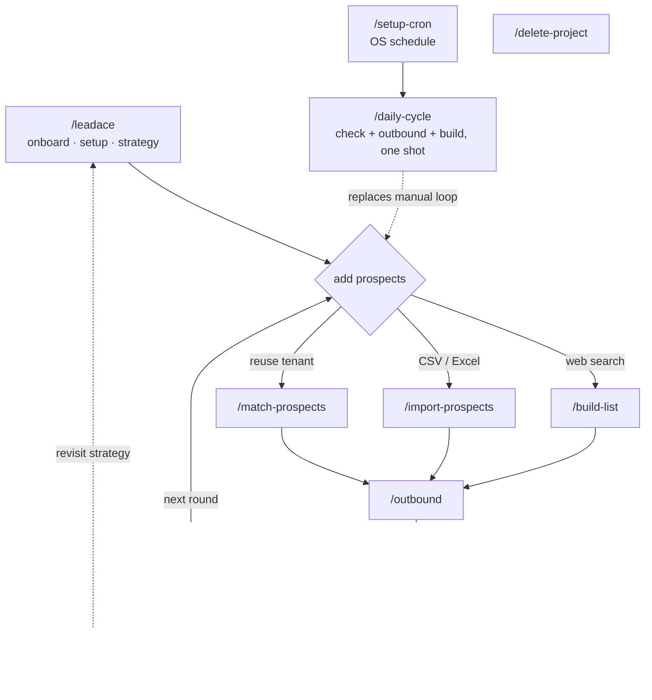

# LeadAce

  [](https://mcpservers.org/servers/aitit-inc/leadace)

Autonomous lead generation plugin for Claude Code and Claude Desktop.
Builds prospect lists, runs outbound outreach, and iterates on strategy — all hands-free.

Website: https://leadace.ai

> **Two ways to run it.** Use the hosted service at [app.leadace.ai](https://app.leadace.ai) (Free tier — 5 outreach/day, paid plans from $29/mo), or [self-host](docs/self-host.md) the backend on your own Cloudflare + Supabase. The plugin is the same in either case — point it at the hosted MCP or your own.

## For Users

### Prerequisites

- Claude Code or Claude Desktop (Anthropic Pro or Max plan)
- A LeadAce account at https://app.leadace.ai (Free tier — no card)
- A connected Gmail account — for sending email (granted when you sign in with Google, or via the "Connect Gmail" banner in the web app)
- Gmail MCP (claude.ai built-in) — for checking email replies
- claude-in-chrome MCP — for form submission and SNS DMs (forms can alternatively use any other browser-automation MCP you configure yourself, e.g. Playwright; SNS DMs require claude-in-chrome)

### Installation

One line in your terminal:

```bash
claude plugin marketplace add aitit-inc/leadace && claude plugin install leadace@leadace
```

Or, from inside a running Claude Code session:

```
/plugin marketplace add aitit-inc/leadace
/plugin install leadace@leadace
```

Or in Claude Desktop: Customize → Plugins → Add from a repository →
`aitit-inc/leadace` → Install → Connectors → Connect, then Customize →
Connectors → LeadAce → Connect and sign in with Google.

To update later:

```
/plugin marketplace update
/plugin update leadace@leadace
```

### Sign in to LeadAce

The first time the plugin calls a LeadAce tool, your browser opens for Google
sign-in (the same Google account as the web app). The token is cached locally
for subsequent runs. See [plugin/README.md](plugin/README.md) for details and
troubleshooting.

### Usage

Most commands take your project name as the first argument (chosen during `/leadace` onboarding); `/leadace` itself takes a free-form question or homepage URL.

| Command | Purpose |
|---|---|
| **Setup** | |
| `/leadace` | Entry point — onboarding, environment setup / re-check, strategy authoring, overview, and routing |
| **Add prospects** (pick one) | |
| `/build-list <name>` | Web search for new prospects |
| `/import-prospects <name>` | Load CSV / Excel / SQLite |
| `/match-prospects <name>` | Reuse prospects already in your tenant |
| **Sales loop** | |
| `/outbound <name>` | Send via email, contact forms, SNS DMs |
| `/check-responses <name>` | Collect Gmail + SNS replies → DB |
| `/evaluate <name>` | PDCA — analyse, auto-improve strategy, and surface tactical rejection signals (recontact queue, decision-maker referrals, targeting hints) |
| **Reflection** | |
| `/check-feedback <name>` | Surface PMF signals from rejection feedback (feature gaps, competitor presence) — ad-hoc product reflection |
| **Automation** | |
| `/daily-cycle <name> [count]` | One-shot bundle: check-responses → evaluate → outbound + build-list |
| `/setup-cron <name>` | Schedule `/daily-cycle` on the OS (LaunchAgent / Task / cron) |
| **Maintenance** | |
| `/delete-project <name>` | Permanently delete a project and all its data |

Projects, prospects, outreach logs, and strategy documents live in the cloud
— there are no local files to manage. Review everything in the web app at
https://app.leadace.ai.

### Flow



Solid arrows = the main loop. Dashed = optional / occasional / wrapper.
`/evaluate` also consumes the tactical slice of rejection feedback (recontact requests, decision-maker referrals, `not_relevant` industry clusters) recorded by `/check-responses` — no separate user step.

---

## License

LeadAce is released under the [LeadAce Open Source License](LICENSE) — a
modified Apache 2.0 with two additional conditions:

- **No multi-tenant SaaS** for third parties without a commercial license
  from SurpassOne Inc. Self-hosting for your own organization is fine.
- **Frontend logo and copyright** must be preserved in any deployment
  exposing the LeadAce console.

### Hosted service (cloud)

- **Free tier:** 1 project, 500 prospects, 5 outreach actions per day (100 lifetime cap)
- **Paid plans** start at $29/month. Manage your subscription from the web app.

### Self-host

See [docs/self-host.md](docs/self-host.md). The self-hosted edition runs on
the unlimited tier — no Stripe, no caps. For commercial-license inquiries,
contact leo.uno@surpassone.com.

---

## For Developers

### Repository layout

```
plugin/                          # Claude Code plugin
├── .claude-plugin/plugin.json   # Manifest
├── .mcp.json                    # MCP server config
├── skills/                      # Slash commands (each directory has SKILL.md)
├── scripts/fetch_url.py         # Local web fetch helper
└── references/                  # Shared reference docs
backend/                         # API + MCP servers (Cloudflare Workers, Hono, Drizzle)
frontend/                        # Web app (SvelteKit, Cloudflare Pages)
docs/                            # Project-wide docs (deploy runbook, self-host, architecture)
docker-compose.yml               # Bare Postgres for non-Supabase local dev
```

- Plugin conventions and the schema-change workflow: [CLAUDE.md](CLAUDE.md)
- Self-hosting and local dev: [docs/self-host.md](docs/self-host.md)

### Quick start (local dev)

One-time setup — copy the env templates:

```bash
cp backend/.dev.vars.example backend/.dev.vars
cp frontend/.env.example frontend/.env
```

Fill in the Supabase keys from `supabase status` — it prints them once the
local stack is running, so run `make dev` once first (it starts Supabase), then
paste the keys in.

For Google sign-in to your local stack, also create a Google OAuth client and
export `SUPABASE_AUTH_EXTERNAL_GOOGLE_CLIENT_ID` / `_SECRET` in your shell (via
`.envrc`) **before** the first `make dev` — it boots Supabase, which reads them
from the shell at start time. See
[docs/self-host.md → Local development](docs/self-host.md#local-development).
(These shell vars gate sign-in; the `GOOGLE_CLIENT_ID` / `_SECRET` in
`backend/.dev.vars` are separate — they power Gmail *send*.)

Then start the whole stack with one command — Supabase, migrations, the master
seed, the API/MCP Workers, and the frontend, all together. Ctrl-C tears the dev
servers down (Supabase stays up for a fast restart; `make stop` halts it):

```bash
make dev          # or: ./scripts/dev.sh
```

| Service | URL |
|---|---|
| Frontend | http://localhost:5273 |
| API Worker | http://localhost:8787 |
| MCP Worker | http://localhost:8788 |
| Supabase Studio | http://localhost:54323 |

To run on different ports (e.g. one is taken by another dev server), copy
`dev.ports.env.example` to `dev.ports.env` and set the ports there — `dev.sh`
rewires every dependent URL (and Google sign-in keeps working). Defaults are
unchanged when the file is absent.

<details>
<summary>Run the steps manually instead</summary>

```bash
npx supabase start                      # Auth + Postgres on ports 54321/54322
cd backend
npm install
npm run db:migrate
npx tsx scripts/seed-master-documents.ts

npm run dev:api                         # API → http://localhost:8787
npm run dev:mcp                         # MCP → http://localhost:8788  (separate terminal)

cd ../frontend
npm install
npm run dev                             # → http://localhost:5273
```
</details>

Pre-release checks:

```bash
cd backend && npm run typecheck
cd frontend && npm run check
```

### Updating dependencies (lockfile gotcha)

`npm install` with `node_modules` already present can prune other-platform
optional deps (`@emnapi/*`, `@img/sharp-*`, `esbuild` binaries) from
`package-lock.json` ([npm/cli#7961](https://github.com/npm/cli/issues/7961), npm
10.3+–11.x). CI then runs `npm ci` against that pruned lockfile and fails with
`Missing: … from lock file`. This bites both `backend/` and `frontend/`, and is
what makes Dependabot's npm PRs go red.

When you change a `package.json` / `package-lock.json` (or repair a Dependabot
PR), regenerate the lockfile under the repo's pinned toolchain — **not** in
Docker:

```bash
nvm use                 # node 22 (repo .nvmrc) — matches CI
cd backend              # or cd frontend
rm -rf node_modules     # removing this first is what avoids the prune
npm install --no-audit --no-fund
```

Then commit the regenerated `package-lock.json`. Code-only changes don't need
this — CI consumes the committed lockfile as-is.
